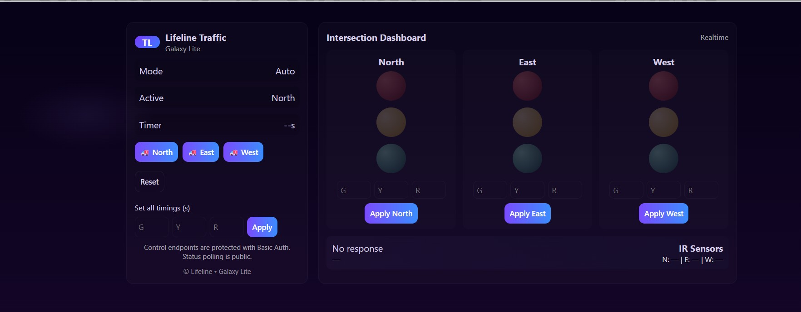
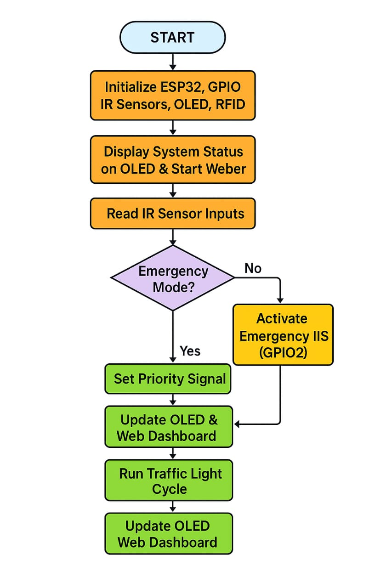
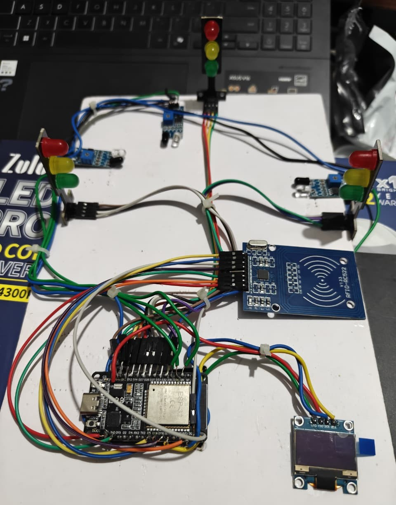

<h1 align="center">🚦 Automated Traffic Control System Using IoT-Based Crowd Analytics</h1>

  

  ESP32 • IoT • RFID • IR Sensors • Embedded Web Dashboard

This project presents an intelligent IoT-enabled traffic control system developed using the ESP32 microcontroller. The system integrates IR-based vehicle detection, RFID-based emergency vehicle authentication, an OLED display, and an embedded offline web dashboard.

The system dynamically adapts traffic signals in real time and provides secure emergency vehicle priority without requiring internet connectivity.

---

## 🎯 Objectives
- Adaptive traffic signal control using IR sensors
- Secure RFID-based emergency vehicle prioritization
- Non-blocking traffic state machine
- Offline web dashboard for monitoring and control
- Real-time OLED status display

---

## 🛠 Hardware Components
- ESP32 DevKit V1
- IR Proximity Sensors
- RC522 RFID Module
- SSD1306 OLED Display
- LED Traffic Signals

---

## 💻 Software Technologies
- Embedded C / C++
- Arduino IDE
- WiFi & WebServer Libraries
- MFRC522 Library
- Adafruit SSD1306 Library
- HTML, CSS, JavaScript (Embedded Dashboard)

---

## 📊 System Architecture

### Architecture Diagram

### Data Flow Diagram

### ESP32 Control Module

---

## 🔧 Hardware Prototype

---

## 📄 Documentation
Complete project report available in:

/documentation/Automated_Traffic_Control_System_Report.pdf

---

## 👨‍💻 Developed By
**V. Naresh**  
Department of Computer Science & Engineering (AIML)  
Embedded Systems & IoT Developer 
---

## 📌 Project Status
✅ Fully Functional Prototype  
✅ Real-Time Testing Completed  
✅ Offline Autonomous Operation
